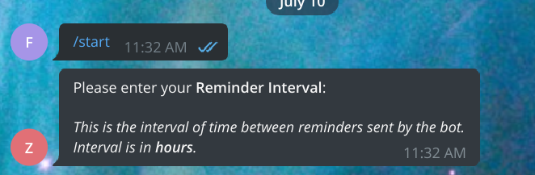

# Usage:

1. Find the bot on Telegram.

   Bot handle: [@zerowastesgbot](t.me/zerowastesgbot)

2. Press `/start`.

   If the `/start` button is not available for you, you can use it as a command (sending it as a message).

3. Enter a suitable interval.

   When prompted for an interval, enter a suitable number.

   For demonstration purposes, we recommended setting it a very small number like `0.001`.

   

   Note: Interval here is in hours (0.001 hours = 0.001 \* 3600 = `3.6 seconds`).

4. Confirm the suitable interval.

   The bot will allow you to modify your input in the event of a mistake.

   It will also check that your input is a valid input (`valid number` in this case).

   Once you are satisfied with your interval, press Confirm to proceed.

   

5. Start the bot.

   You will be presented with a choice whether to start the bot or not.

   Press `Yes` to begin the reminders.

   

6. Use `/stop` to stop the bot.

   

7. Use `/start` again if you wish to modify your interval.

   Note that this will stop the bot similar to `/stop`.

   

<br/>

# Installation:

1.  Dependencies:

    - [pyyaml](https://pypi.org/project/PyYAML/)
    - [python-telegram-bot](https://github.com/python-telegram-bot/python-telegram-bot)

    <br/>

    ```bash
    $ python -m pip install -r requirements.txt

    # or if pip is already in your PATH
    $ pip -r requirements.txt
    ```

    Additionally you can create a virtual environment for your project:

    ```bash
    $ python -m venv venv

    # Unix
    $ source venv/bin/activate
    # Same command as before

    # Windows
    $ .\venv\Scripts\activate.bat
    ```

2.  `config.yaml`:

    You will also need to supply a `config.yaml` file.\
    The following values have be configured in the file:

    ```yaml
    # ---------------------------------- RUNTIME --------------------------------- #
    RUNTIME:
    LIVE_MODE: false
    FRESH_START: false

    # -------------------------------- BOT CONFIG -------------------------------- #
    BOT_TOKENS:
    LIVE: ""
    TEST: ""

    BOT:
    REMOVE_INLINE_KEYBOARD_MARKUP: true

    # -------------------------------- LOG CONFIG -------------------------------- #
    LOG_USER_TO_APP_LOGS: false
    ```

3.  Create a Telegram bot with [BotFather](https://telegram.me/botfather).

    After successfully creating your bot, copy the `BOT TOKEN`.

    Set `config.yaml -> BOT_TOKENS -> LIVE/TEST` to be the token.

4.  Run the bot.

    ```python
    $ python main.py
    ```

    You may need to activate `venv` if you have set it up in the earlier steps.
